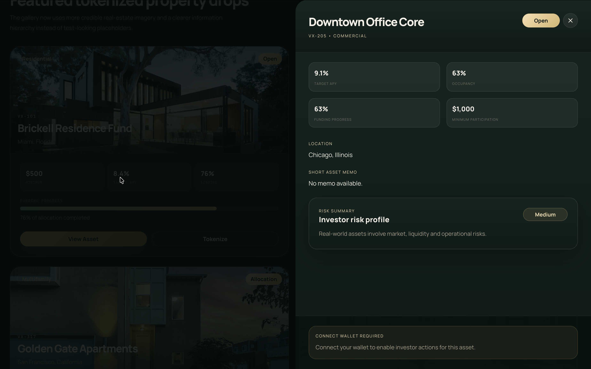
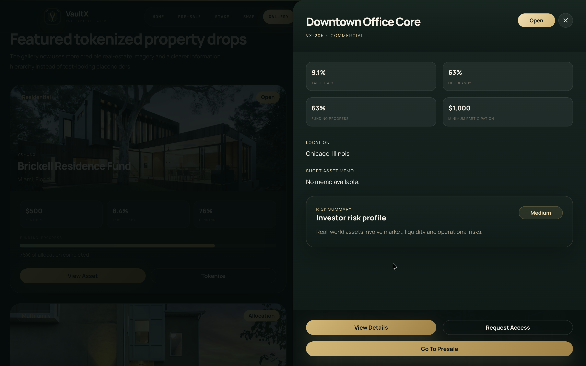
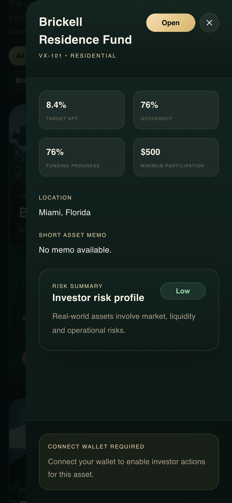
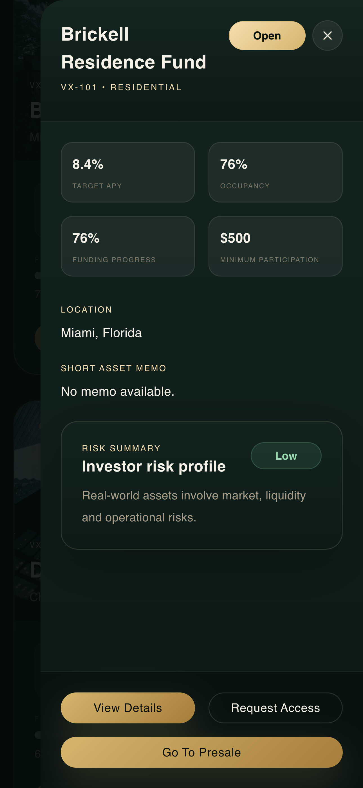

# VaultX RWA dApp — Implementation Summary

I have completed two core implementation tasks for the VaultX Real World Asset (RWA) proof-of-concept platform:

1. **Frontend Enhancement Task (FE-11)** - Investor-focused Asset Detail Drawer
2. **Smart Contract Task (SC-13)** - VaultX Treasury Ledger Contract

These tasks improve both the **user-facing investment experience** and the **on-chain treasury transparency layer**, without requiring backend dependencies.

<br>

<br>

# Task 1 - FE-11: Investor-Focused Asset Detail Drawer (Frontend)

### Objective

I enhanced the VaultX frontend by adding an **investor-grade asset detail drawer**, allowing users to view structured RWA asset data beyond basic marketing-style asset cards.

This feature upgrades the platform from a visual showcase into a **decision-ready investment interface**.

<table width="100%">
  <tr>
    <td align="center" colspan="2">
      <strong>Desktop View</strong>
    </td>
  </tr>

  <tr>
    <td width="50%" align="center" style="vertical-align: top;">
        
      <br/>
      <strong>Wallet Not Connected</strong>
    </td>
    <td width="50%" align="center" style="vertical-align: top;">
        
      <br/>
      <strong>Wallet Connected</strong>
    </td>
  </tr>
</table>

<br>

<table width="100%">
  <tr>
    <td align="center" colspan="2">
      <strong>Mobile View</strong>
    </td>
  </tr>

  <tr>
    <td width="50%" align="center" style="vertical-align: top;">
        
      <br/>
      <strong>Wallet Not Connected</strong>
    </td>
    <td width="50%" align="center" style="vertical-align: top;">
        
      <br/>
      <strong>Wallet Connected</strong>
    </td>
  </tr>
</table>

<br>

## Installation & Run Instructions

### 1. Install dependencies

```bash
npm install
```

### 2. Run frontend

```bash
npm run dev
```

### 3. Open application

```text
http://localhost:5173
```

## Implementation Details

### New Components Added

```text
src/components/assets/AssetDetailDrawer.jsx
src/components/assets/AssetMetricGrid.jsx
src/components/assets/AssetRiskSummary.jsx
src/components/assets/AssetActionPanel.jsx
```

### Updated Components

```text
src/components/gallery/GalleryItems.jsx
src/components/home/HeroSection.jsx
```

## Investor Data Displayed

The Asset Detail Drawer displays structured RWA investment data:

- Asset ID
- Asset Name
- Asset Type
- Location
- Target APY
- Occupancy
- Funding Progress
- Minimum Participation Amount
- Risk Level
- Asset Memo
- Investment Status

## Action Panel Behavior

- View Details
- Request Access
- Go to Presale

### Wallet Rules

If wallet is **not connected**:

- Disable investment actions
- Show message: **Connect Wallet Required**

## Expected Outcomes

- [x] Asset card opens detailed drawer on click
- [x] Investor-focused structured asset view
- [x] No backend dependency required
- [x] Wallet-gated investment actions
- [x] Improved investment clarity and UX

<br>

# Task 2 — SC-13: VaultXTreasuryLedger Smart Contract (Solidity)

I added a standalone **Treasury Ledger contract** to track VaultX treasury allocation categories, reference metadata, and governance-level accounting records.

This improves **on-chain transparency for RWA fund allocation tracking**.

## ⚙️ Installation, Compile & Test Instructions

### 1. Compile contracts

```bash
npx truffle compile --config Truffle/truffle-config.cjs --all
```

### 2. Start local blockchain

```bash
ganache-cli -d --db data -i 1337 --port 7545
```

### 3. Deploy contracts

```bash
npx truffle migrate --reset --network develop --config Truffle/truffle-config.cjs
```

### 4. Run Web3 Validation Script

Run the following script from the **repo root** to validate contract deployment and functionality:

```bash
node --input-type=module <<'NODE'
import fs from 'fs';
import Web3 from 'web3';

const artifact = JSON.parse(
  fs.readFileSync('./build/contracts/VaultXTreasuryLedger.json','utf8')
);

const address = artifact.networks['1337'].address;
const web3 = new Web3('http://127.0.0.1:7545');

const accounts = await web3.eth.getAccounts();
const owner = accounts[0];

const contract = new web3.eth.Contract(artifact.abi, address);

// Create allocation record
const createTx = await contract.methods
  .createAllocationRecord(
    'Operations',
    web3.utils.toWei('1','ether'),
    'ipfs://ops',
    web3.utils.keccak256('ops')
  )
  .send({ from: owner, gas: 500000 });

console.log('create status', createTx.status);

// Read record
const record = await contract.methods.getAllocationRecord(0).call();
console.log('record', record);

// Get count
const count = await contract.methods.getAllocationRecordCount().call();
console.log('count', count);

// Update status
const updateTx = await contract.methods
  .updateAllocationStatus(0, false)
  .send({ from: owner, gas: 200000 });

console.log('update status', updateTx.status);
NODE
```

### 5. Expected Output

```bash
create status 1n

record {
  '0': 'Operations',
  '1': 1000000000000000000n,
  '2': 'ipfs://ops',
  '3': '0x648c1041397070b6773cd376c40d6c1919cba81c9174b0a822ac0f4174eaf131',
  '4': 1780529031n,
  '5': true,
  __length__: 6,
  category: 'Operations',
  amount: 1000000000000000000n,
  referenceURI: 'ipfs://ops',
  referenceHash: '0x648c1041397070b6773cd376c40d6c1919cba81c9174b0a822ac0f4174eaf131',
  createdAt: 1780529031n,
  active: true
}

count 1n
update status 1n
```

## Contract Added

```text
contracts/VaultXTreasuryLedger.sol
```

---

## 🧱 Core Data Structure

### AllocationRecord

- category (string)
- amount (uint256)
- referenceURI (string)
- referenceHash (bytes32)
- createdAt (uint256)
- active (bool)

---

## ⚙️ Core Functions

### 1. createAllocationRecord

Creates a new treasury allocation entry.

### 2. updateAllocationStatus

Activates or deactivates a record.

### 3. getAllocationRecord

Fetches a specific allocation entry.

### 4. getAllocationRecordCount

Returns total number of records.

---

## 🔐 Validation Rules

- Only contract owner can create records
- Only owner can update status
- Category cannot be empty
- Amount must be > 0
- Record must exist

---

## 📡 Events

- AllocationRecordCreated
- AllocationRecordStatusUpdated

---

## 📦 Expected Outcomes

- [x] Contract compiles successfully
- [x] Owner-controlled treasury logging
- [x] Independent from presale/token logic
- [x] Transparent on-chain accounting structure

---

# 📌 Final Notes

- FE-11 enhances **user investment experience**
- SC-13 enhances **on-chain treasury transparency**
- Both modules are independent, non-blocking PoC upgrades
- No backend dependency required

```

```
